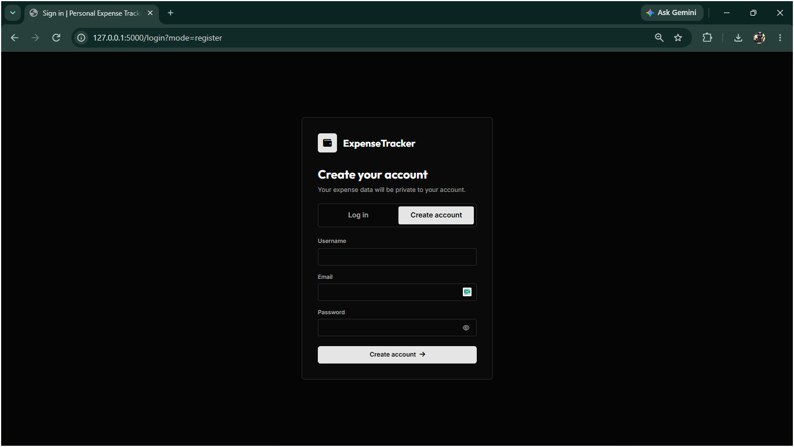
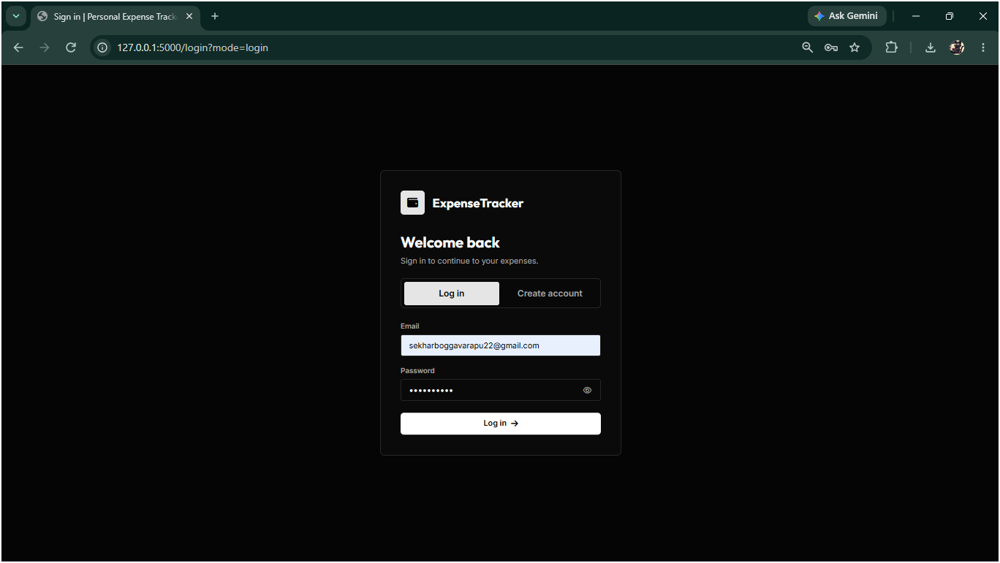
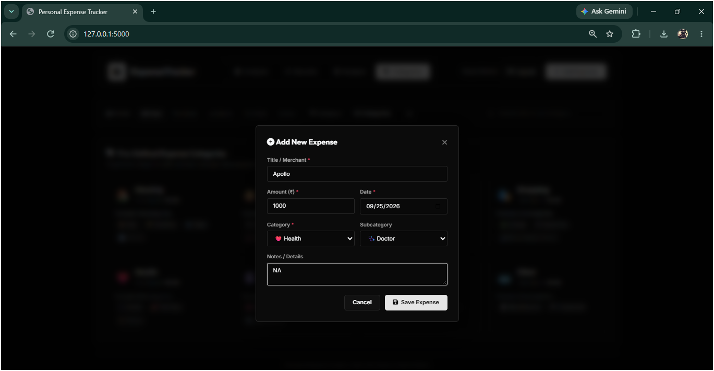
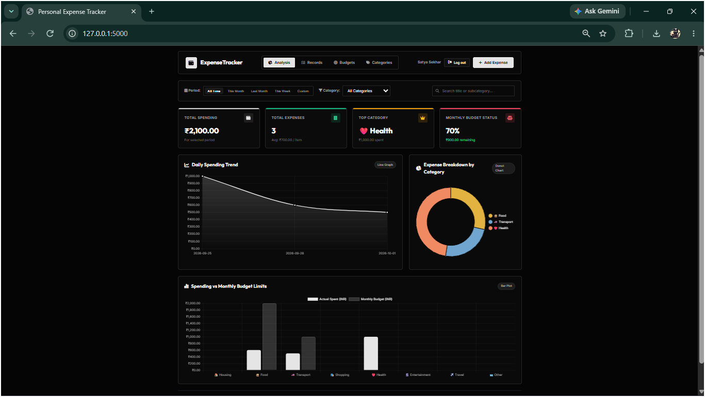
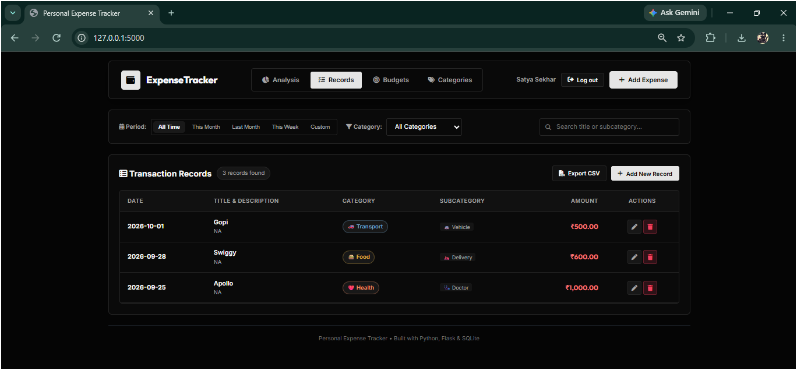
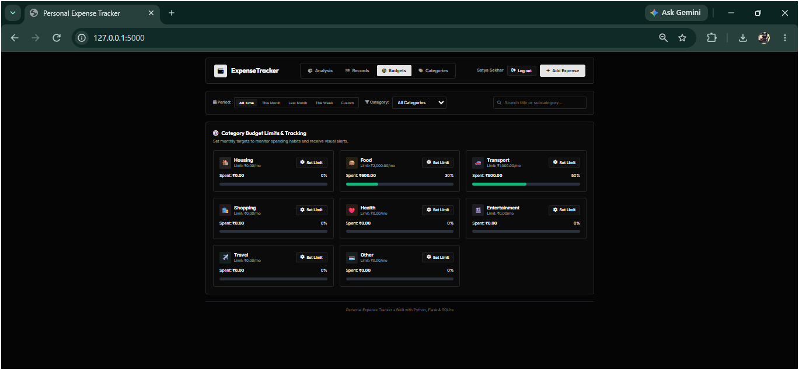
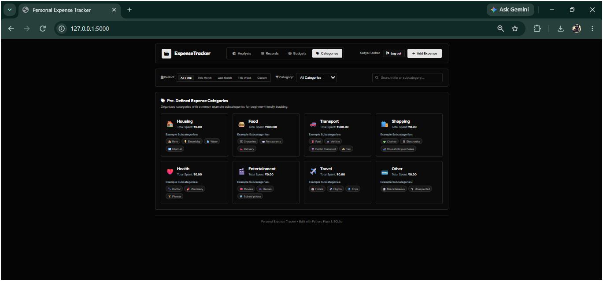

## Personal Expense Tracker: Secure, Account-Based Expense Recording and Budget Analysis

This title describes the application's central purpose: helping individuals record spending, organize transactions, and compare expenses with category budgets. The word "personal" reflects that users sign in to their own accounts and their expenses are scoped to their account. "Analysis" represents the dashboard charts and summaries. The project is a small web application designed for practical, everyday expense management rather than institutional accounting.

## Problem Statement

Personal spending is often recorded inconsistently or not recorded at all, making it difficult to understand where money goes or whether spending is within a plan. A collection of receipts or unstructured notes does not readily answer questions about spending by category, time period, or budget. The project addresses this problem with a single interface for entering transactions, reviewing summaries, setting category limits, filtering records, and exporting data for further use.

## Objectives

The primary objective is to make routine expense tracking understandable and quick for an individual user. The application aims to preserve useful transaction details, including date, amount, category, subcategory, title, and optional notes. It also aims to make spending patterns visible through dashboard indicators and charts, support monthly category budgets, and let users retrieve filtered records. Account authentication and user-based database queries are intended to keep each user's expense and budget data separate.

## Solution

The solution is a browser-based expense tracker implemented with Flask routes and a SQLite database. Users create an account with a username, email, and password, then access the dashboard after authentication. The dashboard communicates with JSON API endpoints to retrieve and modify expenses, categories, budgets, and analytics. JavaScript renders tables, budget summaries, and charts. A CSV endpoint exports records using the active filters. Category definitions supply both category icons and emoji-labelled subcategory choices.

## Tech Stack

Here is the tech stack formatted cleanly as bullet points:

### Backend & Core

- **Python** – Core programming language
- **Flask** – Lightweight web framework for routing, requests, and server-side logic
- **Jinja2** – Server-side HTML template engine

### Database & Storage

- **SQLite** – Lightweight, file-based relational database for local persistence
- **Python `sqlite3**` – Native database driver and query management

### Security & Authentication

- **Werkzeug Security** – Secure password hashing (`generate_password_hash`, `check_password_hash`)
- **Flask Sessions** – Signed, secure session cookies configured with `HttpOnly` and `SameSite=Lax`

### Frontend & Interactivity

- **HTML5 & CSS3** – Document structure and modern, responsive styling
- **Vanilla JavaScript** – Client-side state management, DOM updates, and asynchronous API communication

### UI Components & Visualization

- **Chart.js** – Interactive graphs and data visualizations for the analytics dashboard
- **Font Awesome** – UI icons and category indicators
- **Google Fonts** – Typography styling loaded via CDN

## Example Flow

A new user opens the registration view and provides a username, email address, and password. After registration, the application creates an account and starts a session. The user chooses Add Expense, enters a title and amount in rupees, selects a category, and chooses an emoji-labelled subcategory that matches that category. On submission, the browser sends the expense fields to Flask. Flask validates the input, associates the row with the user's identifier, and stores it in SQLite. The refreshed dashboard then includes the expense in totals, charts, budget comparisons, the records table, and filtered CSV downloads.

## 📺 Project Demo

> 💡 **Want to see how it works?** 
> Check out the step-by-step walkthrough in our [Demo Video (MP4)](assets/DEMO_PET_Project.mp4) or view the screenshots below!

## 📸 Application Screenshots

### 1. Signup & Login page
Quick Signup to create a user and Login for later sessions.

### 2. Add Expense

### 3. Dashboard View

## Findings

The current implementation brings account management, expense entry, budgets, filters, analytics, and export together in one application without requiring a separate database server. Per-user query scoping is present for expense and budget data, and password hashes are stored instead of raw passwords. The design uses fixed predefined categories and a local SQLite file, making the project straightforward to run for personal or demonstration use. It is not yet a production-grade financial platform: it has basic rather than comprehensive email validation, relies on a configured stable secret key for persistent sessions, and loads some interface resources from external CDNs.

## Conclusion

The Personal Expense Tracker provides a usable foundation for organizing individual spending. It combines account-based access with CRUD operations for expenses, category budgets, useful summary calculations, visualizations, and CSV export. The interface supports Indian rupee formatting and category-aware emoji subcategories while retaining simple stored subcategory values. Its Flask and SQLite architecture keeps setup compact and understandable. The project meets its core personal-tracking goals, while its deployment, security, testing, and long-term data-management practices can be strengthened before broader use.
